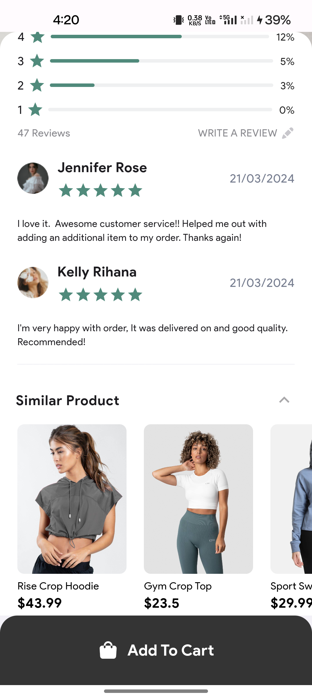

# Fluxestore

A D2C E-Commerce app built in Flutter.


## Getting Started

## Description

Fluxestore is a Direct-to-Consumer (D2C) E-Commerce application developed using the Flutter framework with NodeJS as runtime and MondoBD as database. It provides users with a seamless shopping experience, allowing them to browse, search for, and purchase a variety of products directly from their mobile devices.

## Features

### View detailed product information, including images, descriptions, prices, and ratings.
<table>
  <tr>
    <td>Product Details Screene</td>
     <td>Product Details Screene</td>
  </tr>
  <tr>
    <td></td>
    <td></td>
  </tr>
 </table>


### Browse and search for products by category, brand, or keyword.
### Add products to a cart for later purchase.
### Secure checkout process for placing orders.
### User authentication and account management features.
### Order tracking and history functionality.
### Wishlist feature for saving favorite products.

## Installation

To install and run Fluxestore locally, follow these steps:

1. Clone the repository from GitHub:

```bash
  git clone https://github.com/Nilav2608/fluxestore_E-commerce
```

2. Open a new terminal and run this command

```bash
  flutter pub get
```

3. Before running this app go this github repository
##[fluxstore-backend-source-code](https://github.com/Nilav2608/fluxstore_backend)
 follow installation process and install the backend

4.As you are running the backend locally we have to get the IPv4 address of your local meachine. So that run this command

 ```bash
  ipconfig
 ```

 copy the IPv4 address, For Example

 ```bash
   192.168.1.1
 ```

5. Now create a new .env file inside the app root folder and you will need to add the following environment variables to your .env file

`BASE_URL_PRODUCTION`

6. Now assing the local host url to the `BASE_URL_PRODUCTION` environment variable. Replace your IPv4 address with <your IPv4 address> tag 

Example

 ```bash
   BASE_URL_PRODUCTION = http://<your IPv4 address>:5000
 ```

7. Now run this app using terminal or using command pallate.

```bash
   flutter run
 ```
